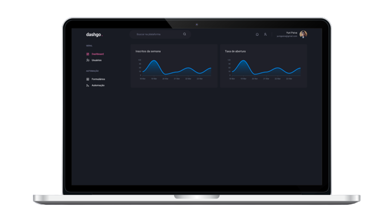

# dashgo &middot;   

<br/>

<div align="center">
  
</div>

<br>

## 💡 Introduction

Dashboard web application

- Subscription graphics
- Table of users
- Add new users
- Authentication

<br>

## 🧪 Technologies and Services

- [React](https://reactjs.org)
- [NextJS](https://nextjs.org/)
- [ChakraUI](https://chakra-ui.com/)
- [MirageJS](https://miragejs.com/)

<br />

## 🖥 Pre-requisites:

- NodeJS
- Yarn

<br/>

## 🚀 How to Run it?

From project's root file:

```sh
$ yarn install
$ yarn dev
```

<br>

## 📝 License

MIT License © Yuri Paiva. Check [LICENSE](LICENSE) for more details

---

<br>

Made with 💜 &nbsp;by Yuri Paiva
